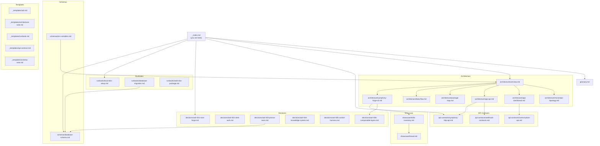

# Symphony Cloud Knowledge Graph

> [!context]
> This is the entry point for the Symphony Cloud knowledge system. Every agent session should start here to understand the codebase topology, conventions, and decision history before making changes.

## Graph Map

## Tag Taxonomy

| Prefix | Values | Purpose |
|--------|--------|---------|
| `domain/` | `auth`, `database`, `billing`, `dashboard`, `api`, `symphony-client`, `infra`, `all` | Which subsystem the note covers |
| `phase/` | `1` (foundation), `2` (schema+SDK), `3` (dashboard), `4` (polish), `5` (scale) | Roadmap phase |
| `status/` | `draft`, `active`, `deprecated` | Note lifecycle |
| `type/` | `architecture`, `api-contract`, `decision`, `runbook`, `schema`, `index`, `glossary`, `template` | Document type |

## Traversal Instructions

1. **Start here** -- read this index to orient yourself in the knowledge graph
2. **Understand the system** -- read [[architecture/overview]] and [[glossary]]
3. **Find the relevant subsystem** -- follow links to specific architecture notes
4. **Check for decisions** -- before proposing alternatives, read [[decisions/adr-001-next-forge]] through the relevant ADRs
5. **Follow runbooks** -- for operational tasks, use the runbook for that workflow
6. **Use templates** -- when creating new docs, copy from [[_templates/adr]], [[_templates/architecture-note]], [[_templates/runbook]], [[_templates/api-contract]], or [[_templates/schema-note]]

## Document Registry

### Architecture
- [[architecture/overview]] -- System architecture with Mermaid diagrams
- [[architecture/monorepo-topology]] -- Turborepo workspace map
- [[architecture/app-dashboard]] -- `apps/app` (dashboard :3000)
- [[architecture/app-api]] -- `apps/api` (API :3002)
- [[architecture/package-map]] -- All 20 packages with dependencies
- [[architecture/data-flow]] -- Request flow diagrams
- [[architecture/symphony-forge-cli]] -- CLI architecture, layer system, build pipeline

### API Contracts
- [[api-contracts/symphony-http-api]] -- Symphony engine HTTP API
- [[api-contracts/control-plane-api]] -- Control plane REST API
- [[api-contracts/webhook-contracts]] -- Stripe and Clerk webhook schemas

### Decisions
- [[decisions/adr-001-next-forge]] -- Why next-forge as the foundation
- [[decisions/adr-002-clerk-auth]] -- Clerk as auth provider
- [[decisions/adr-003-prisma-neon]] -- Prisma ORM + Neon PostgreSQL
- [[decisions/adr-004-knowledge-system]] -- This knowledge system
- [[decisions/adr-005-control-harness]] -- Control metalayer design
- [[decisions/adr-006-composable-layers]] -- Composable layer architecture

### Runbooks
- [[runbooks/local-dev-setup]] -- Getting started from scratch
- [[runbooks/database-migration]] -- Schema change workflow
- [[runbooks/add-new-package]] -- Creating new workspace packages

### Schemas
- [[schemas/database-schema]] -- Prisma schema documentation
- [[schemas/env-variables]] -- Environment variables catalog

### Showcase
- [[showcase/symphony-forge]] -- Product showcase video (35s, Remotion)
- [[showcase/skills-inventory]] -- Agent skills ecosystem inventory and visualization
- [[showcase/thread]] -- 7-post X thread for skills showcase

### Glossary
- [[glossary]] -- Key terms and definitions
