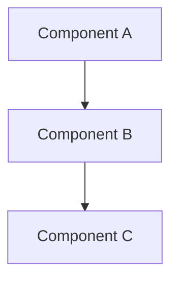

# [Component/System Name]

> [!context]
> Brief description of what this component/system does and why it exists.

## Overview

<!-- High-level description. What does this do? Where does it fit in the architecture? -->

## Architecture Diagram

## Key Components

| Component | File/Path | Purpose |
|-----------|-----------|---------|
| | | |

## Data Flow

<!-- How does data move through this system? -->

## Dependencies

| Dependency | Usage |
|------------|-------|
| | |

## Configuration

<!-- What env vars, config files, or settings are needed? -->

## Current State

<!-- What is the current implementation status? -->

## Planned Changes

<!-- What changes are planned? Which phase? -->

## Related

- [[architecture/overview]]
