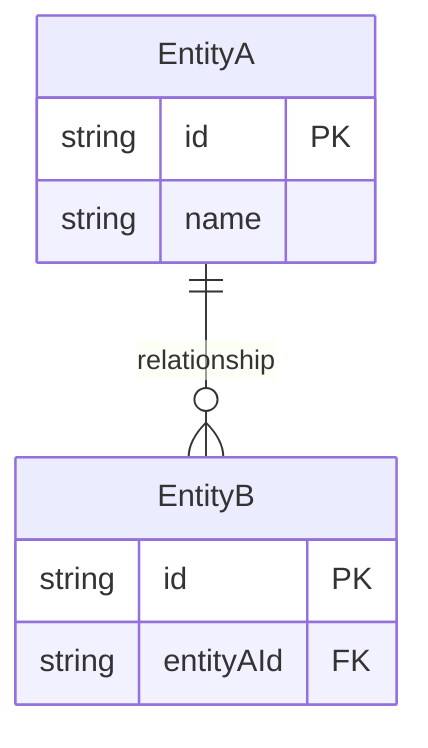

# [Schema Name]

> [!context]
> Brief description of what this schema defines and where it is used.

## Overview

<!-- What data does this schema describe? Where is it defined? -->

## Schema Definition

<!-- The actual schema, in whatever format is appropriate -->

```
# Prisma, JSON Schema, TypeScript interface, env var table, etc.
```

## Entity Relationship Diagram



## Field Reference

| Field | Type | Constraints | Description |
|-------|------|-------------|-------------|
| | | | |

## Enums

| Enum | Values | Description |
|------|--------|-------------|
| | | |

## Conventions

<!-- Naming conventions, patterns, constraints -->

## Migration History

<!-- Notable schema changes -->

| Date | Change | Migration |
|------|--------|-----------|
| | | |

## Related

- [[schemas/database-schema]]
- [[runbooks/database-migration]]
