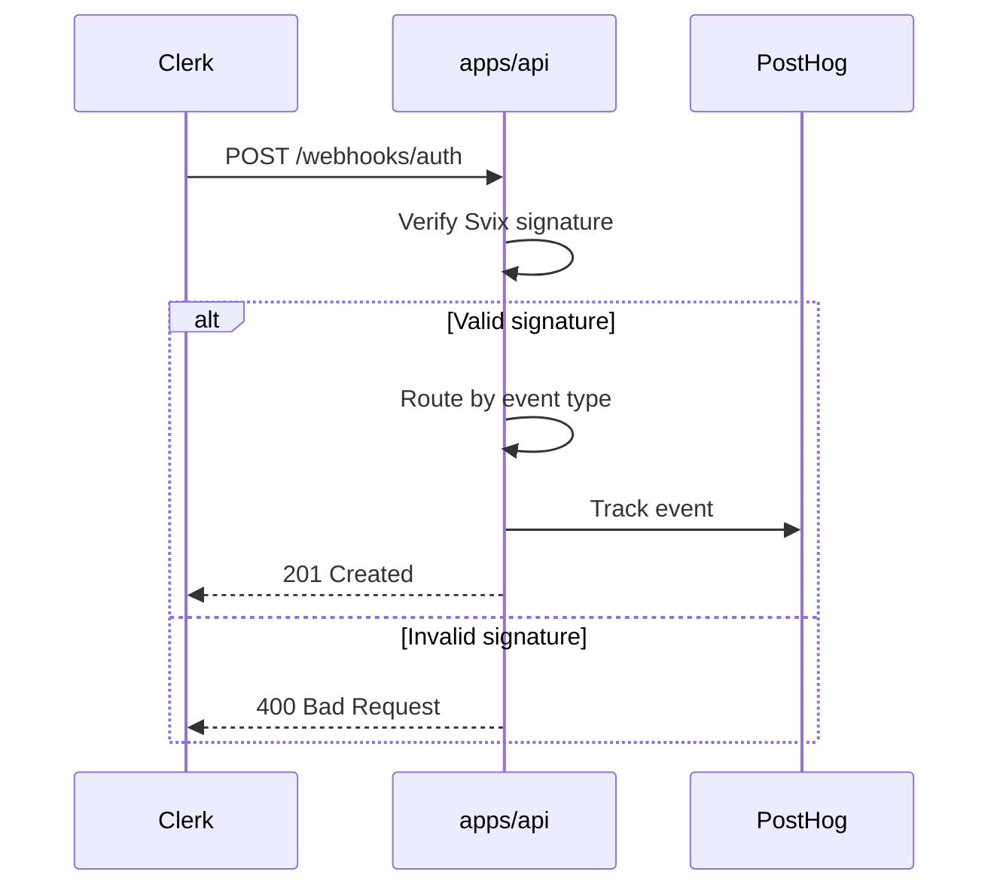
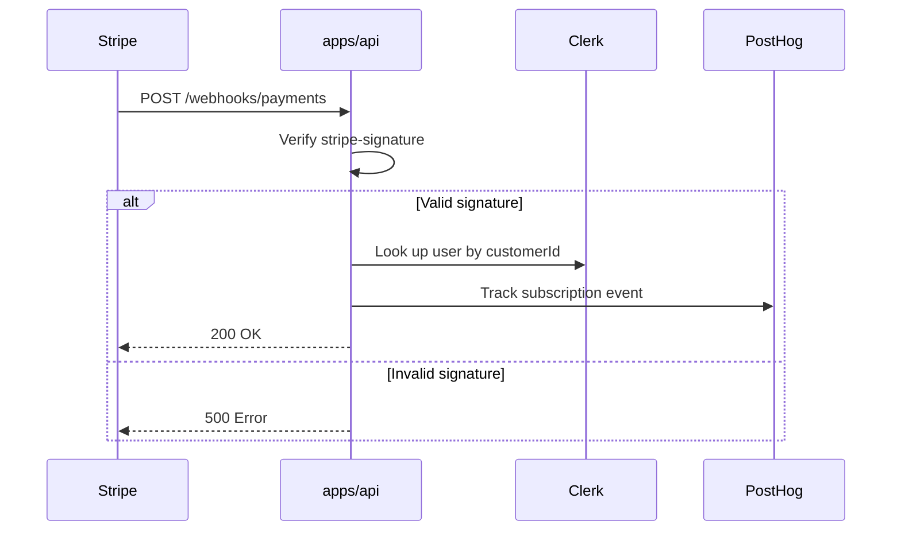

# App: API (`apps/api`)

> [!context]
> The API app serves as the control plane for Symphony Cloud. It runs on port 3002 and handles webhook ingestion (Clerk, Stripe), health checks, background jobs, and will serve the REST API for the dashboard.

## Route Structure

```
apps/api/app/
├── layout.tsx                    # Root layout
├── global-error.tsx              # Sentry error boundary
├── icon.png / apple-icon.png    # Assets
├── opengraph-image.png
├── health/
│   └── route.ts                 # GET /health — API health check
├── webhooks/
│   ├── auth/route.ts            # POST /webhooks/auth — Clerk webhooks
│   └── payments/route.ts        # POST /webhooks/payments — Stripe webhooks
└── cron/
    └── keep-alive/route.ts      # GET /cron/keep-alive — Cron job
```

## Webhook Architecture

### Clerk Webhooks (`/webhooks/auth`)

Clerk sends webhooks via Svix. The handler verifies the signature using `svix-id`, `svix-timestamp`, and `svix-signature` headers.



**Handled Events**:

| Event Type | Handler | Action |
|------------|---------|--------|
| `user.created` | `handleUserCreated` | Identify user in PostHog, track creation |
| `user.updated` | `handleUserUpdated` | Update user properties in PostHog |
| `user.deleted` | `handleUserDeleted` | Mark user as deleted in PostHog |
| `organization.created` | `handleOrganizationCreated` | Create group in PostHog |
| `organization.updated` | `handleOrganizationUpdated` | Update group in PostHog |
| `organizationMembership.created` | `handleOrganizationMembershipCreated` | Link user to group |
| `organizationMembership.deleted` | `handleOrganizationMembershipDeleted` | Track membership removal |

### Stripe Webhooks (`/webhooks/payments`)

Stripe sends webhooks with a `stripe-signature` header. The handler verifies using `stripe.webhooks.constructEvent()`.



**Handled Events**:

| Event Type | Handler | Action |
|------------|---------|--------|
| `checkout.session.completed` | `handleCheckoutSessionCompleted` | Track "User Subscribed" |
| `subscription_schedule.canceled` | `handleSubscriptionScheduleCanceled` | Track "User Unsubscribed" |

> [!important]
> The Stripe webhook handler looks up users by matching `privateMetadata.stripeCustomerId` on Clerk user objects. This couples Stripe and Clerk identity resolution.

## Package Dependencies

| Package | Usage |
|---------|-------|
| `@repo/auth` | `clerkClient` for user lookup, webhook event types |
| `@repo/database` | Database access (planned for control plane routes) |
| `@repo/payments` | `stripe` client, `Stripe` types |
| `@repo/observability` | `log` for structured logging, `parseError` for error formatting |
| `@repo/analytics` | `analytics` for PostHog event tracking |

## Configuration

The API app requires these environment variables:

| Variable | Required | Purpose |
|----------|----------|---------|
| `CLERK_WEBHOOK_SECRET` | For auth webhooks | Svix verification secret |
| `STRIPE_WEBHOOK_SECRET` | For payment webhooks | Stripe signature verification |

See [[schemas/env-variables]] for the complete env var catalog.

## Planned Control Plane Routes (Phase 3)

The API app will be extended with REST endpoints that the dashboard consumes:

| Route | Methods | Purpose |
|-------|---------|---------|
| `/v1/instances` | GET, POST | Instance CRUD |
| `/v1/instances/[id]` | GET, PATCH, DELETE | Instance detail |
| `/v1/instances/[id]/state` | GET | Proxy to engine state |
| `/v1/instances/[id]/refresh` | POST | Proxy to engine refresh |
| `/v1/workflows` | GET, POST | Workflow CRUD |
| `/v1/workflows/[id]` | GET, PATCH, DELETE | Workflow detail |
| `/v1/workflows/[id]/deploy` | POST | Deploy workflow to instance |
| `/v1/runs` | GET | Paginated run history |
| `/v1/runs/[id]` | GET | Run detail |
| `/v1/api-keys` | GET, POST | API key management |
| `/v1/api-keys/[id]` | DELETE | Revoke API key |
| `/v1/usage` | GET | Usage statistics |
| `/v1/settings` | GET, PATCH | Organization settings |

See [[api-contracts/control-plane-api]] for the full API contract.
