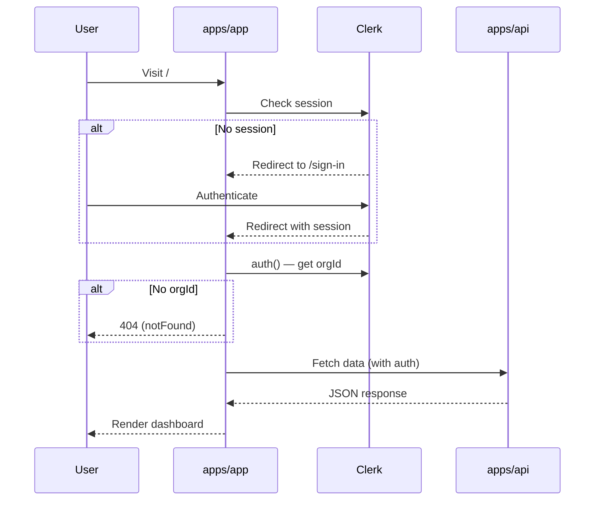

# App: Dashboard (`apps/app`)

> [!context]
> The dashboard is the primary user-facing application. It runs on port 3000 and provides authenticated access to agent management, workflow editing, instance monitoring, and usage tracking.

## Route Structure

```
apps/app/app/
├── layout.tsx                          # Root layout (providers, fonts, CSS)
├── styles.css                          # Global styles (Tailwind v4)
├── global-error.tsx                    # Sentry error boundary
├── icon.png / apple-icon.png          # Favicon assets
├── opengraph-image.png                # OG image
├── .well-known/vercel/flags/route.ts  # Feature flags endpoint
├── actions/
│   └── users/
│       ├── get.ts                     # Server action: get user
│       └── search.ts                  # Server action: search users
├── api/
│   └── collaboration/
│       └── auth/route.ts              # Liveblocks auth endpoint
├── (unauthenticated)/
│   ├── layout.tsx                     # Public layout (sign-in/sign-up)
│   ├── sign-in/[[...sign-in]]/page.tsx
│   └── sign-up/[[...sign-up]]/page.tsx
└── (authenticated)/
    ├── layout.tsx                     # Auth-gated layout with sidebar
    ├── page.tsx                       # Main dashboard page
    ├── search/page.tsx                # Search results
    ├── webhooks/page.tsx              # Webhook management
    └── components/
        ├── sidebar.tsx                # Global sidebar navigation
        ├── header.tsx                 # Page header with breadcrumbs
        ├── search.tsx                 # Search component
        ├── avatar-stack.tsx           # Collaboration avatars
        ├── cursors.tsx                # Live cursors (Liveblocks)
        ├── collaboration-provider.tsx # Liveblocks provider
        └── notifications-provider.tsx # Notification system
```

## Authentication Flow



## Key Architectural Decisions

### Server Components by Default

The dashboard uses Next.js App Router with Server Components as the default. Only components requiring browser APIs or interactivity use the `'use client'` directive.

**Server Components** (no `'use client'`):
- `page.tsx` -- fetches data directly from database
- `header.tsx` -- renders breadcrumbs
- `avatar-stack.tsx` -- renders collaboration avatars

**Client Components** (`'use client'`):
- `sidebar.tsx` -- uses `useSidebar()` hook for collapse state
- `cursors.tsx` -- real-time cursor tracking
- `collaboration-provider.tsx` -- Liveblocks provider
- `search.tsx` -- interactive search input

### Organization-Scoped Access

All authenticated pages require `orgId` from Clerk's `auth()`. If no organization is selected, the page returns `notFound()`. This enforces multi-tenancy at the route level.

### Dynamic Imports

The `CollaborationProvider` is loaded with `next/dynamic` to avoid importing Liveblocks when the `LIVEBLOCKS_SECRET` env var is not configured.

## Package Dependencies

| Package | Usage |
|---------|-------|
| `@repo/auth` | `auth()` server-side, `OrganizationSwitcher` and `UserButton` client-side |
| `@repo/database` | Direct Prisma queries in Server Components |
| `@repo/design-system` | All UI components (Button, Sidebar, Collapsible, DropdownMenu) |
| `@repo/collaboration` | Liveblocks real-time collaboration |
| `@repo/notifications` | `NotificationsTrigger` component |
| `@repo/observability` | Error tracking via Sentry |

## Current State

> [!warning]
> The dashboard currently shows the next-forge template default content. The main page displays `Page` model records from the database with "Acme Inc" branding. This will be replaced with Symphony Cloud agent management UI.

## Planned Changes (Phase 3)

The dashboard will be rewritten to include:
- Stats cards (active agents, tokens, retrying, runtime)
- Agent management table
- Workflow editor
- Instance monitoring
- Run history
- Usage charts
- API key management

See [[architecture/data-flow]] for how the dashboard interacts with the control plane.
