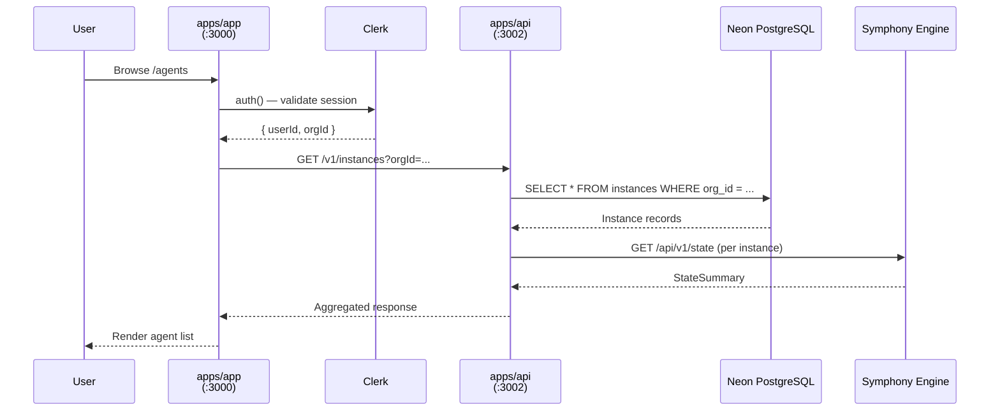
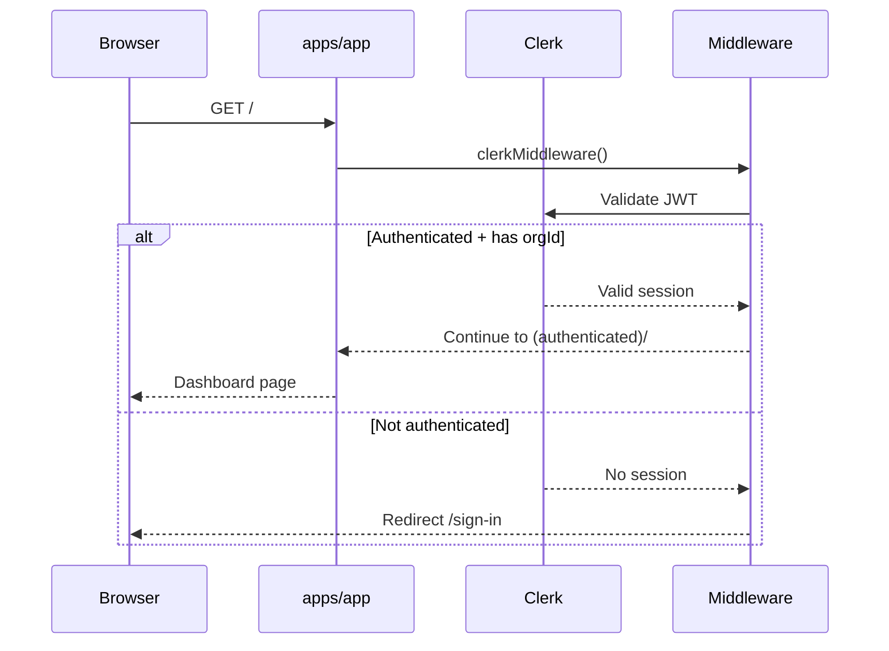
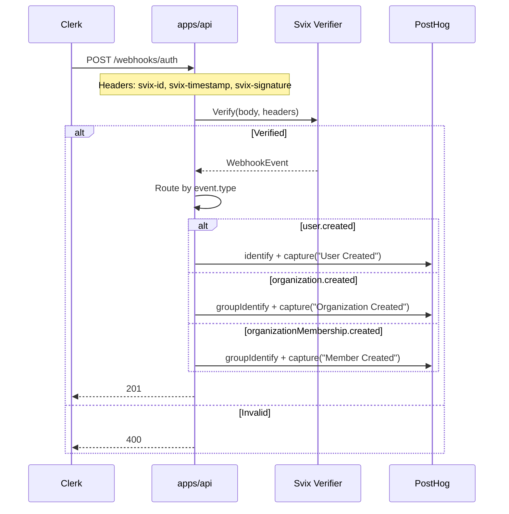
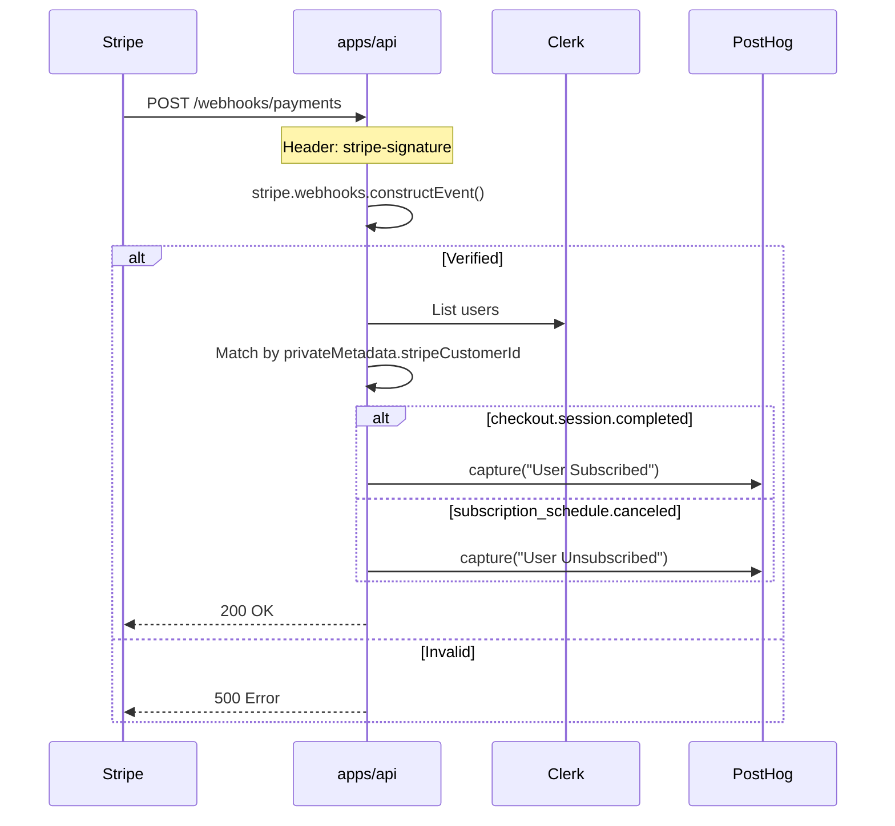
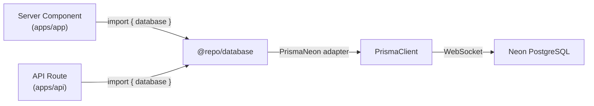
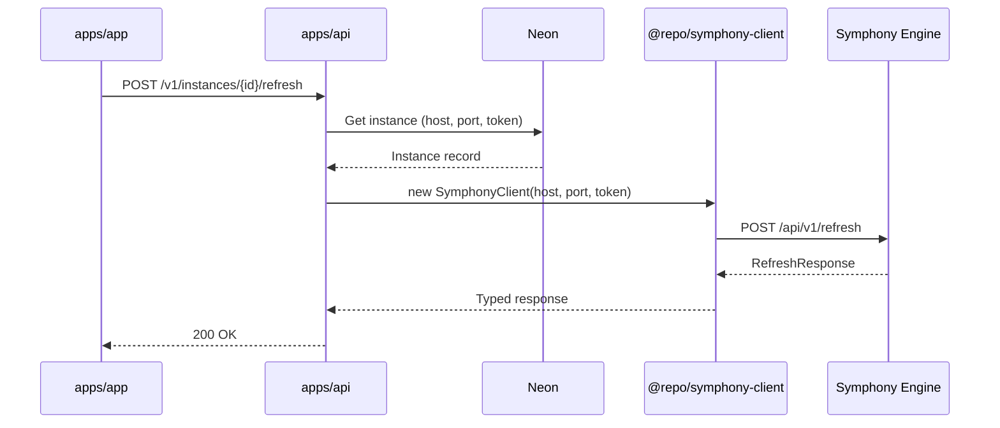
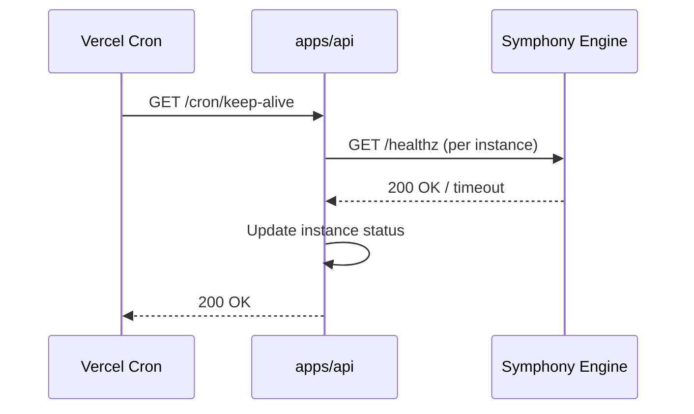

# Data Flow Diagrams

> [!context]
> This document traces the primary data flows through Symphony Cloud, from user interaction through to the Symphony engine and external services.

## Primary Request Flow: Dashboard to Engine

## Authentication Flow

## Webhook Flow: Clerk Events

## Webhook Flow: Stripe Events

## Database Access Pattern

> [!important]
> The `@repo/database` package uses `server-only`, so it cannot be imported in Client Components. All database access must happen in Server Components or API routes.

## Symphony Engine Proxy Flow (Planned)

## Cron Job Flow

## Data Flow Summary

| Flow | Source | Destination | Protocol | Auth |
|------|--------|-------------|----------|------|
| Dashboard data fetch | `apps/app` | `apps/api` | HTTP (internal) | Clerk JWT |
| Engine proxy | `apps/api` | Symphony Engine | HTTP | API token (per instance) |
| Clerk webhooks | Clerk | `apps/api` | HTTPS + Svix | Svix signature |
| Stripe webhooks | Stripe | `apps/api` | HTTPS | Stripe signature |
| Database queries | `@repo/database` | Neon | WebSocket | Connection string |
| Analytics events | `@repo/analytics` | PostHog | HTTPS | API key |
| Error reporting | `@repo/observability` | Sentry | HTTPS | DSN |
| Collaboration | `@repo/collaboration` | Liveblocks | WebSocket | Secret key |

See [[api-contracts/symphony-http-api]] for the complete engine API contract and [[api-contracts/control-plane-api]] for the control plane REST API.
