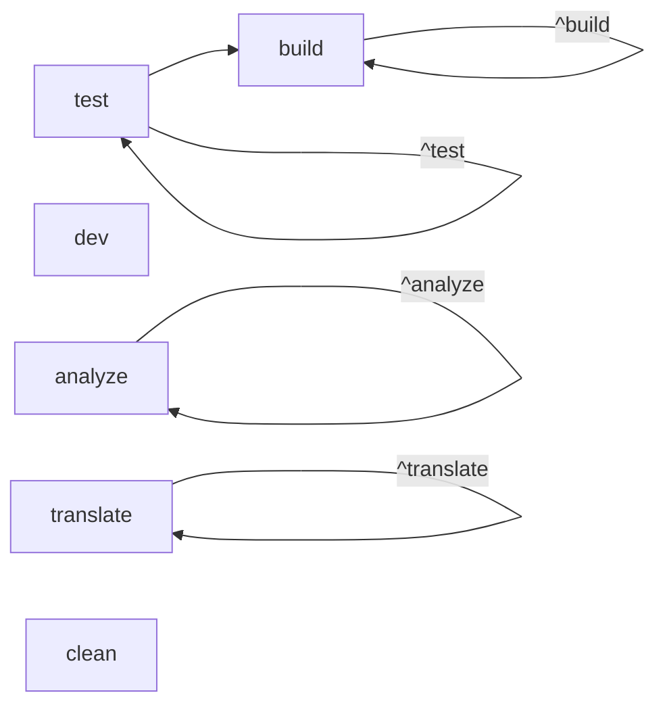

# Monorepo Topology

> [!context]
> Symphony Cloud uses a next-forge Turborepo monorepo. This document maps the complete workspace structure, build dependencies, and task pipeline.

## Workspace Structure

```
symphony-cloud/
├── apps/
│   ├── app/          # Dashboard (Next.js, :3000)
│   ├── api/          # Control plane API (Next.js, :3002)
│   ├── web/          # Marketing site (Next.js, :3001)
│   ├── docs/         # API docs (Mintlify, :3004)
│   ├── email/        # Email templates (React Email, :3003)
│   ├── storybook/    # Component dev (Storybook, :6006)
│   └── studio/       # DB management (Prisma Studio, :3005)
├── packages/
│   ├── ai/                    # @repo/ai — AI/LLM integrations
│   ├── analytics/             # @repo/analytics — PostHog
│   ├── auth/                  # @repo/auth — Clerk
│   ├── cms/                   # @repo/cms — BaseHub CMS
│   ├── collaboration/         # @repo/collaboration — Liveblocks
│   ├── database/              # @repo/database — Prisma + Neon
│   ├── design-system/         # @repo/design-system — shadcn/ui
│   ├── email/                 # @repo/email — Resend
│   ├── feature-flags/         # @repo/feature-flags
│   ├── internationalization/  # @repo/internationalization — i18n
│   ├── next-config/           # @repo/next-config — Shared config
│   ├── notifications/         # @repo/notifications
│   ├── observability/         # @repo/observability — Sentry + Logtail
│   ├── payments/              # @repo/payments — Stripe
│   ├── rate-limit/            # @repo/rate-limit — Upstash
│   ├── security/              # @repo/security — CSP, headers
│   ├── seo/                   # @repo/seo — Metadata, OG images
│   ├── storage/               # @repo/storage — File uploads
│   ├── typescript-config/     # @repo/typescript-config — Shared tsconfig
│   └── webhooks/              # @repo/webhooks — Webhook utilities
├── docs/                      # Knowledge graph (this system)
├── scripts/                   # Build and dev scripts
├── turbo.json                 # Turborepo task configuration
├── biome.jsonc                # Linter/formatter config
├── tsconfig.json              # Root TypeScript config
├── tsup.config.ts             # Bundle config
├── package.json               # Root workspace config
└── bun.lock                   # Dependency lock file
```

## Turborepo Task Pipeline

Defined in `turbo.json`:



| Task | Dependencies | Cache | Outputs |
|------|-------------|-------|---------|
| `build` | `^build`, `test` | Yes | `.next/**`, `**/generated/**`, `storybook-static/**`, `.react-email/**` |
| `test` | `^test` | Yes | -- |
| `dev` | -- | No | -- (persistent) |
| `analyze` | `^analyze` | Yes | -- |
| `translate` | `^translate` | No | -- |
| `clean` | -- | No | -- |

> [!important]
> The `build` task depends on `test` passing first. This means `bun build` will run all tests before building any app.

## Workspace Configuration

From root `package.json`:

- **Workspaces**: `["apps/*", "packages/*"]`
- **Package Manager**: `bun@1.3.10`
- **Node Engine**: `>=18`
- **Module System**: ESM (`"type": "module"`)

## Key Root Scripts

| Script | Command | Purpose |
|--------|---------|---------|
| `bun dev` | `turbo dev` | Start all apps in dev mode |
| `bun build` | `turbo build` | Build all apps (runs tests first) |
| `bun check` | `ultracite check` | Lint with Biome |
| `bun test` | `turbo test` | Run Vitest across workspaces |
| `bun migrate` | `prisma format + generate + migrate dev` | Database migration |
| `bun db:push` | `prisma format + generate + db push` | Push schema without migration |

## Global Dependencies

The Turborepo configuration tracks `**/.env.*local` as a global dependency, meaning any env file change invalidates all task caches.

See [[architecture/package-map]] for detailed inter-package dependencies.
