# System Architecture Overview

> [!context]
> Symphony Cloud is the managed SaaS layer on top of Symphony, the open-source Rust coding agent orchestrator. This document describes the high-level architecture, including all apps, packages, and external service integrations.

## Architecture Diagram

```mermaid
graph TB
    subgraph External Services
        CLERK["Clerk<br/>(Auth)"]
        STRIPE["Stripe<br/>(Billing)"]
        NEON["Neon PostgreSQL<br/>(Database)"]
        SENTRY["Sentry<br/>(Observability)"]
        POSTHOG["PostHog<br/>(Analytics)"]
        LOGTAIL["Logtail<br/>(Logging)"]
        LIVEBLOCKS["Liveblocks<br/>(Collaboration)"]
        BASEHUB["BaseHub<br/>(CMS)"]
        RESEND["Resend<br/>(Email)"]
        UPSTASH["Upstash<br/>(Rate Limit)"]
    end

    subgraph "Symphony Engine (Rust)"
        ENGINE["Symphony Orchestrator<br/>/api/v1/*"]
    end

    subgraph "Apps (Next.js 15)"
        APP["app<br/>Dashboard :3000"]
        API["api<br/>Control Plane :3002"]
        WEB["web<br/>Marketing :3001"]
        DOCS["docs<br/>Mintlify :3004"]
        EMAIL["email<br/>React Email :3003"]
        STORYBOOK["storybook<br/>Component Dev :6006"]
        STUDIO["studio<br/>Prisma Studio :3005"]
    end

    subgraph "Packages (@repo/*)"
        AUTH["@repo/auth"]
        DB["@repo/database"]
        PAY["@repo/payments"]
        DS["@repo/design-system"]
        OBS["@repo/observability"]
        ANALYTICS["@repo/analytics"]
        AI_PKG["@repo/ai"]
        COLLAB["@repo/collaboration"]
        CMS_PKG["@repo/cms"]
        EMAIL_PKG["@repo/email"]
        FF["@repo/feature-flags"]
        I18N["@repo/internationalization"]
        NC["@repo/next-config"]
        NOTIF["@repo/notifications"]
        RL["@repo/rate-limit"]
        SEC["@repo/security"]
        SEO["@repo/seo"]
        STORE["@repo/storage"]
        TS["@repo/typescript-config"]
        WH["@repo/webhooks"]
    end

    APP --> AUTH
    APP --> DB
    APP --> DS
    APP --> OBS
    APP --> COLLAB
    APP --> NOTIF

    API --> AUTH
    API --> DB
    API --> PAY
    API --> OBS
    API --> ANALYTICS
    API --> WH

    WEB --> DS
    WEB --> CMS_PKG
    WEB --> SEO

    AUTH --> CLERK
    DB --> NEON
    PAY --> STRIPE
    OBS --> SENTRY
    OBS --> LOGTAIL
    ANALYTICS --> POSTHOG
    COLLAB --> LIVEBLOCKS
    CMS_PKG --> BASEHUB
    EMAIL_PKG --> RESEND
    RL --> UPSTASH

    API -.->|"proxy"| ENGINE
```

## Application Layer

Symphony Cloud runs 7 applications, each a separate Next.js (or framework-specific) workspace.

| App | Port | Purpose | Key Dependencies |
|-----|------|---------|-----------------|
| `app` | 3000 | Authenticated dashboard for managing agents, instances, workflows | `@repo/auth`, `@repo/database`, `@repo/design-system`, `@repo/collaboration` |
| `api` | 3002 | REST API + webhook handlers (Clerk, Stripe) | `@repo/auth`, `@repo/database`, `@repo/payments`, `@repo/analytics` |
| `web` | 3001 | Public marketing site | `@repo/design-system`, `@repo/cms`, `@repo/seo` |
| `docs` | 3004 | API documentation (Mintlify) | Standalone |
| `email` | 3003 | Email template development (React Email) | `@repo/email` |
| `storybook` | 6006 | Component development and testing | `@repo/design-system` |
| `studio` | 3005 | Database management (Prisma Studio) | `@repo/database` |

See [[architecture/app-dashboard]] and [[architecture/app-api]] for detailed architecture of the two primary apps.

## Package Layer

20 shared packages under `packages/` provide cross-cutting functionality. See [[architecture/package-map]] for the complete dependency graph.

## Data Flow

The primary data flow is:

1. User authenticates via Clerk in `apps/app`
2. Dashboard fetches data from `apps/api` control plane
3. Control plane reads/writes to Neon PostgreSQL via Prisma
4. Control plane proxies engine commands to Symphony instances
5. Stripe webhooks update billing state via `apps/api`
6. Clerk webhooks sync user/org events via `apps/api`

See [[architecture/data-flow]] for detailed request flow diagrams.

## Symphony Engine Integration

The Symphony engine is a separate Rust process that exposes an HTTP API. Symphony Cloud connects to it via the `@repo/symphony-client` package (planned). The engine API is documented in [[api-contracts/symphony-http-api]].

| Endpoint | Method | Purpose |
|----------|--------|---------|
| `/api/v1/state` | GET | Cluster state summary |
| `/api/v1/{identifier}` | GET | Issue/agent detail |
| `/api/v1/workspaces` | GET | Workspace listing |
| `/api/v1/refresh` | POST | Trigger poll cycle |
| `/api/v1/shutdown` | POST | Graceful shutdown |
| `/healthz` | GET | Liveness probe |
| `/readyz` | GET | Readiness probe |

## Technology Stack

| Layer | Technology | Version |
|-------|-----------|---------|
| Framework | Next.js | 15 |
| Language | TypeScript | 5.9 |
| Package Manager | Bun | 1.3.10 |
| Build System | Turborepo | 2.8+ |
| Linter | Biome | 2.4.6 |
| Test Runner | Vitest | 4.0+ |
| ORM | Prisma | Latest (prisma-client generator) |
| Database | Neon PostgreSQL | Serverless |
| Auth | Clerk | @clerk/nextjs 7.x |
| Payments | Stripe | stripe 20.x |
| Observability | Sentry | @sentry/nextjs 10.x |
| UI Components | shadcn/ui | Via @repo/design-system |
| Styling | Tailwind CSS | v4 |
