# Package Map

> [!context]
> Symphony Cloud has 20 shared packages under `packages/`. Each is a private workspace package scoped to `@repo/`. This document catalogs every package, its purpose, external dependencies, and which apps consume it.

## Package Overview

```mermaid
graph TD
    subgraph "Core Infrastructure"
        TS["@repo/typescript-config"]
        NC["@repo/next-config"]
        DS["@repo/design-system"]
    end

    subgraph "Auth & Security"
        AUTH["@repo/auth<br/>Clerk"]
        SEC["@repo/security"]
        RL["@repo/rate-limit<br/>Upstash"]
    end

    subgraph "Data Layer"
        DB["@repo/database<br/>Prisma + Neon"]
        PAY["@repo/payments<br/>Stripe"]
    end

    subgraph "Observability"
        OBS["@repo/observability<br/>Sentry + Logtail"]
        ANALYTICS["@repo/analytics<br/>PostHog"]
    end

    subgraph "Features"
        AI["@repo/ai"]
        COLLAB["@repo/collaboration<br/>Liveblocks"]
        CMS["@repo/cms<br/>BaseHub"]
        EMAIL["@repo/email<br/>Resend"]
        FF["@repo/feature-flags"]
        I18N["@repo/internationalization"]
        NOTIF["@repo/notifications"]
        SEO["@repo/seo"]
        STORE["@repo/storage"]
        WH["@repo/webhooks"]
    end

    AUTH --> TS
    DB --> TS
    PAY --> TS
    OBS --> TS
    DS --> TS
    NC --> TS
    SEC --> TS
    RL --> TS
    ANALYTICS --> TS
    AI --> TS
    COLLAB --> TS
    CMS --> TS
    EMAIL --> TS
    FF --> TS
    I18N --> TS
    NOTIF --> TS
    SEO --> TS
    STORE --> TS
    WH --> TS
```

## Complete Package Catalog

### Core Infrastructure

| Package | npm Name | External Deps | Purpose |
|---------|----------|---------------|---------|
| `typescript-config` | `@repo/typescript-config` | TypeScript 5.9 | Shared `tsconfig.json` base configurations |
| `next-config` | `@repo/next-config` | -- | Shared Next.js configuration (`next.config.ts` helpers) |
| `design-system` | `@repo/design-system` | shadcn/ui, Tailwind CSS v4, Radix UI | UI component library, mode toggle, utility functions |

### Auth & Security

| Package | npm Name | External Deps | Purpose |
|---------|----------|---------------|---------|
| `auth` | `@repo/auth` | `@clerk/nextjs` 7.x, `@clerk/themes` | Authentication: `auth()` server-side, `OrganizationSwitcher`/`UserButton` client-side, webhook event types |
| `security` | `@repo/security` | -- | CSP headers, security middleware |
| `rate-limit` | `@repo/rate-limit` | Upstash | Rate limiting for API routes |

### Data Layer

| Package | npm Name | External Deps | Purpose |
|---------|----------|---------------|---------|
| `database` | `@repo/database` | Prisma, `@neondatabase/serverless`, `ws` | ORM + database client. Exports `database` (PrismaClient) and generated types. See [[schemas/database-schema]]. |
| `payments` | `@repo/payments` | `stripe` 20.x, `@stripe/agent-toolkit` | Stripe client, payment types, subscription management |

### Observability

| Package | npm Name | External Deps | Purpose |
|---------|----------|---------------|---------|
| `observability` | `@repo/observability` | `@sentry/nextjs` 10.x, `@logtail/next` | Error tracking (Sentry), structured logging (Logtail), `parseError` utility |
| `analytics` | `@repo/analytics` | PostHog | Product analytics: `identify`, `capture`, `groupIdentify`, `shutdown` |

### Features

| Package | npm Name | External Deps | Purpose |
|---------|----------|---------------|---------|
| `ai` | `@repo/ai` | -- | AI/LLM integration utilities |
| `collaboration` | `@repo/collaboration` | Liveblocks | Real-time collaboration: cursors, presence, room management |
| `cms` | `@repo/cms` | BaseHub | Content management system integration |
| `email` | `@repo/email` | Resend | Transactional email sending and templates |
| `feature-flags` | `@repo/feature-flags` | -- | Feature flag management |
| `internationalization` | `@repo/internationalization` | -- | i18n support, translations |
| `notifications` | `@repo/notifications` | -- | In-app notification system, `NotificationsTrigger` component |
| `seo` | `@repo/seo` | -- | Metadata helpers, `applicationName`, OG image generation |
| `storage` | `@repo/storage` | -- | File upload and storage utilities |
| `webhooks` | `@repo/webhooks` | -- | Webhook receipt and verification utilities |

## App-to-Package Dependencies

| App | Packages Used |
|-----|--------------|
| `apps/app` | `auth`, `database`, `design-system`, `collaboration`, `notifications`, `observability`, `feature-flags`, `next-config` |
| `apps/api` | `auth`, `database`, `payments`, `observability`, `analytics`, `webhooks`, `next-config` |
| `apps/web` | `design-system`, `cms`, `seo`, `analytics`, `observability`, `next-config` |
| `apps/docs` | (standalone Mintlify) |
| `apps/email` | `email` |
| `apps/storybook` | `design-system` |
| `apps/studio` | `database` |

## Shared Patterns

All packages follow these conventions:

1. **Environment validation**: Uses `@t3-oss/env-nextjs` with Zod schemas in a `keys.ts` file
2. **Server-only**: Most packages import `server-only` to prevent client-side bundling of secrets
3. **TypeScript config**: Extends `@repo/typescript-config`
4. **Clean script**: `git clean -xdf .cache .turbo dist node_modules`
5. **Typecheck script**: `tsc --noEmit --emitDeclarationOnly false`

## Planned Packages

| Package | Purpose | Phase |
|---------|---------|-------|
| `symphony-client` | Type-safe HTTP client for Symphony engine API | Phase 2 |

See [[architecture/overview]] for how packages fit into the overall architecture.
