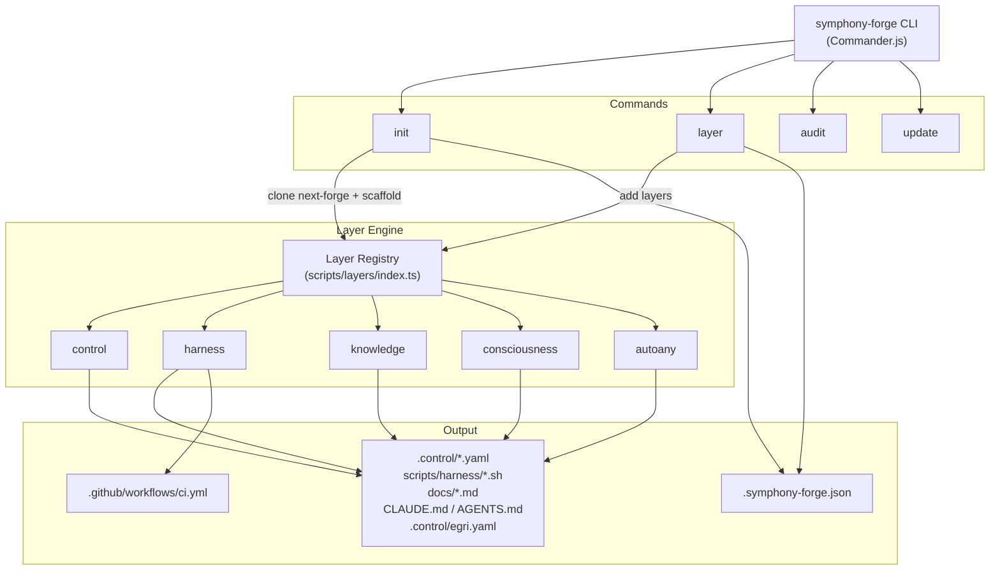
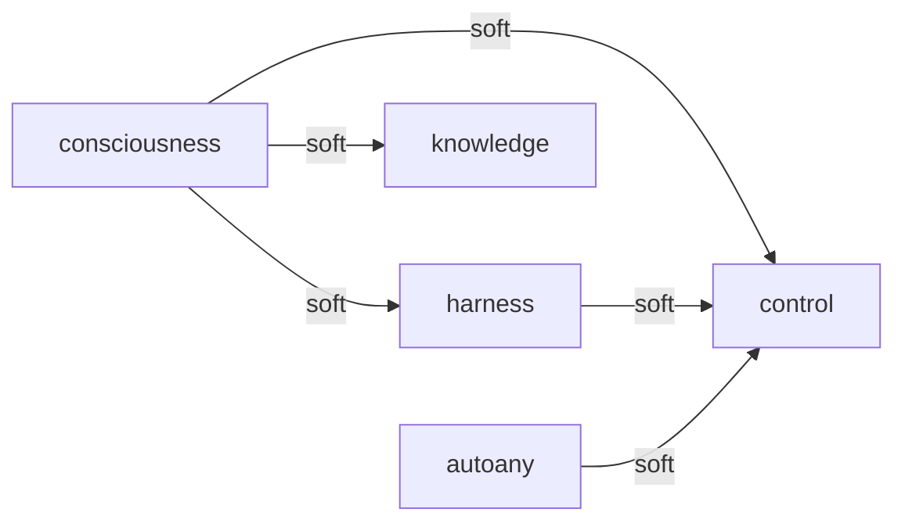

# Architecture: symphony-forge CLI

> [!context]
> symphony-forge is the CLI tool that scaffolds next-forge projects with a composable control metalayer for AI agent governance. This document describes the CLI architecture, layer system, and build pipeline.

## System Overview



## Entry Points

| File | Role |
|------|------|
| `scripts/index.ts` | CLI entry point (Commander.js program) |
| `scripts/initialize.ts` | `init` — clones next-forge, runs scaffold |
| `scripts/scaffold.ts` | Layer orchestration after init |
| `scripts/layer-cmd.ts` | `layer` subcommand handler |
| `scripts/audit-cmd.ts` | `audit` subcommand handler |
| `scripts/update.ts` | `update` — pull upstream next-forge changes |

## Layer System

Each layer implements the `Layer` interface:

```typescript
interface Layer {
  name: string;
  description: string;
  dependsOn?: string[];
  generate: (config: ProjectConfig) => FileEntry[];
  postInstall?: (config: ProjectConfig, projectDir: string) => Promise<void>;
}
```

Layers are **composable** — each works independently but adjusts content based on co-installed layers via the `hasLayer()` utility. The `consciousness` layer emits `> [!warning]` callouts for missing layers.

### Layer Dependency Graph



All dependencies are **soft** — layers generate valid output without their dependencies, but produce richer content when dependencies are present.

## Build Pipeline

```
scripts/*.ts → tsup → dist/index.js (single ESM bundle)
```

- **tsup** bundles all TypeScript into one `dist/index.js`
- Templates are inline (TypeScript template literals, not separate files)
- `package.json` `files` field publishes only `dist/index.js`
- `bin` field registers both `symphony-forge` and `next-forge` commands

## Package Manager Portability

All generated content is parameterized via utility functions:

| Utility | Purpose |
|---------|---------|
| `pmRun(config, script)` | `bun run X` / `npm run X` / `pnpm X` / `yarn X` |
| `pmExec(config, cmd)` | `bunx X` / `npx X` / `pnpm exec X` / `yarn dlx X` |
| `pmInstall(config)` | `bun install` / `npm install` / `pnpm install` / `yarn install` |
| `lockFileName(config)` | `bun.lock` / `package-lock.json` / `pnpm-lock.yaml` / `yarn.lock` |
| `bashHeader(name, timeout?)` | Bash strict mode header with REPO_ROOT |

## Manifest

Every `layer` or `init` operation writes `.symphony-forge.json`:

```json
{
  "version": "0.1.0",
  "installedLayers": ["control", "harness", "knowledge", "consciousness", "autoany"],
  "packageManager": "bun",
  "createdAt": "2026-03-17T00:00:00.000Z",
  "updatedAt": "2026-03-17T00:00:00.000Z"
}
```

## Audit System

The `audit` command checks 4 categories:

1. **Manifest** — `.symphony-forge.json` exists and is valid JSON
2. **Topology Coverage** — all `apps/` and `packages/` dirs listed in `.control/topology.yaml`
3. **Stale Docs** — any `docs/*.md` older than 90 days
4. **Index Coverage** — every `docs/*.md` referenced in `docs/_index.md`

## Distribution Channels

| Channel | Command |
|---------|---------|
| npm | `npx symphony-forge init my-project` |
| GitHub | `git clone https://github.com/broomva/symphony-forge` |
| Agent skill | `npx skills add broomva/symphony-forge` |

## Related Docs

- [[decisions/adr-005-control-harness]] — Why the control metalayer exists
- [[decisions/adr-006-composable-layers]] — Why layers are composable
- [[architecture/overview]] — The SaaS platform this tool scaffolds
