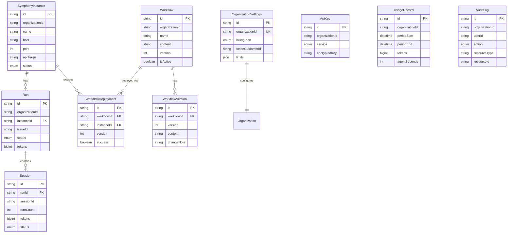

# Database Schema

> [!context]
> This documents the Prisma schema for Symphony Cloud, defined in `packages/database/prisma/schema.prisma`. The database is Neon PostgreSQL, accessed via the `@prisma/adapter-neon` WebSocket adapter.

## Schema Configuration

```prisma
generator client {
  provider = "prisma-client"
  output   = "../generated"
}

datasource db {
  provider     = "postgresql"
  relationMode = "prisma"
}
```

> [!important]
> `relationMode = "prisma"` means foreign key constraints are enforced at the application level, not the database level. Referential integrity depends on correct application logic.

## Current Schema (Stub)

The current schema has a single stub model:

```prisma
model Page {
  id   Int    @id @default(autoincrement())
  name String
}
```

> [!warning]
> This is the next-forge template stub. It will be replaced with the full Symphony Cloud schema in Phase 2.

## Planned Schema (Phase 2)

### Entity Relationship Diagram



### Models

#### SymphonyInstance

Tracks Symphony engine instances registered by each organization.

| Field | Type | Constraints | Description |
|-------|------|-------------|-------------|
| `id` | String | `@id @default(cuid())` | Primary key |
| `organizationId` | String | `@@index` | Clerk organization ID (tenant) |
| `name` | String | | Human-readable instance name |
| `host` | String | | Engine hostname/IP |
| `port` | Int | | Engine port |
| `apiToken` | String? | | Encrypted bearer token |
| `status` | InstanceStatus | | `provisioning`, `running`, `stopped`, `error` |
| `createdAt` | DateTime | `@default(now())` | |
| `updatedAt` | DateTime | `@updatedAt` | |
| `deletedAt` | DateTime? | | Soft delete timestamp |

#### Workflow

Stores WORKFLOW.md documents that define agent behavior.

| Field | Type | Constraints | Description |
|-------|------|-------------|-------------|
| `id` | String | `@id @default(cuid())` | Primary key |
| `organizationId` | String | `@@index` | Tenant scope |
| `name` | String | | Workflow name |
| `content` | String | | WORKFLOW.md content |
| `version` | Int | `@default(1)` | Current version number |
| `isActive` | Boolean | `@default(true)` | Whether actively deployed |
| `createdAt` | DateTime | `@default(now())` | |
| `updatedAt` | DateTime | `@updatedAt` | |
| `deletedAt` | DateTime? | | Soft delete |

#### Run

Tracks individual agent execution runs.

| Field | Type | Constraints | Description |
|-------|------|-------------|-------------|
| `id` | String | `@id @default(cuid())` | Primary key |
| `organizationId` | String | `@@index` | Tenant scope |
| `instanceId` | String | | Which engine ran this |
| `issueId` | String | | Issue/task identifier |
| `status` | RunStatus | | `queued`, `running`, `completed`, `failed`, `cancelled` |
| `tokens` | BigInt | `@default(0)` | Total tokens consumed |
| `startedAt` | DateTime? | | When execution began |
| `completedAt` | DateTime? | | When execution finished |
| `createdAt` | DateTime | `@default(now())` | |
| `updatedAt` | DateTime | `@updatedAt` | |

#### Session

Turn-level tracking within a run.

| Field | Type | Constraints | Description |
|-------|------|-------------|-------------|
| `id` | String | `@id @default(cuid())` | Primary key |
| `runId` | String | `@@index` | Parent run |
| `sessionId` | String | | Engine session identifier |
| `turnCount` | Int | `@default(0)` | Number of turns |
| `tokens` | BigInt | `@default(0)` | Tokens for this session |
| `status` | SessionStatus | | `active`, `completed`, `failed` |
| `createdAt` | DateTime | `@default(now())` | |
| `updatedAt` | DateTime | `@updatedAt` | |

#### ApiKey

Encrypted storage for external service API keys.

| Field | Type | Constraints | Description |
|-------|------|-------------|-------------|
| `id` | String | `@id @default(cuid())` | Primary key |
| `organizationId` | String | `@@index` | Tenant scope |
| `service` | ApiKeyService | | `openai`, `anthropic`, `github`, `custom` |
| `encryptedKey` | String | | Encrypted key value |
| `createdAt` | DateTime | `@default(now())` | |
| `deletedAt` | DateTime? | | Soft delete |

#### UsageRecord

Billing period usage aggregation.

| Field | Type | Constraints | Description |
|-------|------|-------------|-------------|
| `id` | String | `@id @default(cuid())` | Primary key |
| `organizationId` | String | `@@index` | Tenant scope |
| `periodStart` | DateTime | | Billing period start |
| `periodEnd` | DateTime | | Billing period end |
| `tokens` | BigInt | `@default(0)` | Total tokens |
| `agentSeconds` | Int | `@default(0)` | Total agent runtime |
| `createdAt` | DateTime | `@default(now())` | |

#### AuditLog

Tracks who did what in the system.

| Field | Type | Constraints | Description |
|-------|------|-------------|-------------|
| `id` | String | `@id @default(cuid())` | Primary key |
| `organizationId` | String | `@@index` | Tenant scope |
| `userId` | String | | Clerk user ID |
| `action` | AuditAction | | Action type |
| `resourceType` | String | | e.g., "instance", "workflow" |
| `resourceId` | String | | Resource being acted on |
| `metadata` | Json? | | Additional context |
| `createdAt` | DateTime | `@default(now())` | |

#### OrganizationSettings

Per-tenant configuration and billing info.

| Field | Type | Constraints | Description |
|-------|------|-------------|-------------|
| `id` | String | `@id @default(cuid())` | Primary key |
| `organizationId` | String | `@unique` | One settings record per org |
| `billingPlan` | BillingPlan | `@default(free)` | Subscription tier |
| `stripeCustomerId` | String? | | Stripe customer reference |
| `limits` | Json | | `{ maxInstances, maxTokensPerMonth, maxConcurrentAgents }` |
| `createdAt` | DateTime | `@default(now())` | |
| `updatedAt` | DateTime | `@updatedAt` | |

### Enums

| Enum | Values |
|------|--------|
| `InstanceStatus` | `provisioning`, `running`, `stopped`, `error` |
| `RunStatus` | `queued`, `running`, `completed`, `failed`, `cancelled` |
| `SessionStatus` | `active`, `completed`, `failed` |
| `ApiKeyService` | `openai`, `anthropic`, `github`, `custom` |
| `AuditAction` | `create`, `update`, `delete`, `deploy`, `start`, `stop` |
| `BillingPlan` | `free`, `pro`, `enterprise` |

## Design Conventions

- **IDs**: `@id @default(cuid())` for all primary keys
- **Tokens**: `BigInt` type to handle large token counts without overflow
- **Soft deletes**: `deletedAt DateTime?` on models that support deletion
- **Tenant scoping**: `@@index([organizationId])` on every tenant-scoped table
- **Table naming**: `@@map("snake_case")` for PostgreSQL table names
- **No user table**: User data lives in Clerk, referenced by string user IDs

## Related

- [[decisions/adr-003-prisma-neon]] -- Why Prisma + Neon
- [[runbooks/database-migration]] -- Migration workflow
- [[architecture/data-flow]] -- Database access patterns
- [[api-contracts/control-plane-api]] -- API that reads/writes this schema
