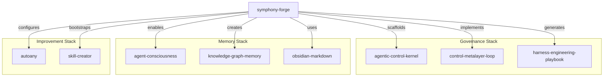

# Agent Skills Inventory

> [!context]
> symphony-forge installs as an agent skill across 42+ AI coding agents. This document catalogs the full skills ecosystem that symphony-forge operates within.

## symphony-forge as a Skill

```bash
# Install globally across all agents
npx skills add broomva/symphony-forge

# Install for a specific project
npx skills add broomva/symphony-forge --skill symphony-forge
```

**Supported agents**: Claude Code, Cursor, GitHub Copilot, Windsurf, Cline, Codex, Gemini CLI, Goose, Roo Code, Trae, and 30+ more.

## Skills Ecosystem Overview

symphony-forge is part of a broader agent skills ecosystem spanning **86 skills across 15 categories**:

| Category | Count | Examples |
|----------|-------|---------|
| AI & Agent Systems | 6 | ai-sdk, claude-api, agentic-control-kernel, autoany, control-metalayer-loop |
| Memory & Knowledge | 5 | agent-consciousness, knowledge-graph-memory, obsidian-markdown, obsidian-bases |
| Research & Intelligence | 5 | deep-research, financial-deep-research, competitor-intel, technical-research |
| Observability & Debugging | 5 | sentry-fix-issues, langsmith-trace, langsmith-fetch |
| Deployment & Infrastructure | 7 | symphony, **symphony-forge**, railway, vercel-cli, cicd-workflows |
| Next.js & React | 8 | next-best-practices, next-forge, next-cache-components, vercel-react-best-practices |
| Mobile & Expo | 7 | building-ui, react-native-skills, tailwind-setup, use-dom |
| Design & UI Systems | 6 | building-components, frontend-design, liquid-glass-design, streamdown |
| JSON-Render Ecosystem | 5 | json-render-core, json-render-react, json-render-shadcn, json-render-remotion |
| MCP & Protocol | 4 | building-mcp-servers, mcp-builder, mcp-integration-expert, ucp |
| Database & API | 4 | using-neon, api-documentation, workflow, workflow-init |
| QA & Browser Testing | 5 | dogfood, gstack, agent-browser, before-and-after, rams |
| CLI & Workflow Tooling | 6 | domain-cli, turborepo, autoship, linear-cli, gsd |
| Design Tooling | 3 | remotion-best-practices, ai-elements, app-store-optimization |
| Platform Specialties | 10 | rust-best-practices, local-llm-ops, find-skills, skill-creator, skills |

## The Control Metalayer in the Skills Ecosystem

symphony-forge sits at the intersection of several skill clusters:



## Creating Project Skills

symphony-forge generates projects that can host their own agent skills. See the [[architecture/symphony-forge-cli]] for the skill creation workflow, or use:

```bash
npx skills init my-skill
```

## Showcase

The skills inventory is visualized as a 48-second animated video (1080x1080, 30fps) rendered with Remotion:

- **Intro**: Title + skill count stats
- **15 category sections**: Staggered chip animations per category
- **Outro**: Summary metrics and CTA

Generated artifacts:
- `out/skills-showcase.mp4` — Primary video (H.264)
- `out/skills-showcase.gif` — Fallback preview
- `thread.md` — 7-post X thread copy

## Related

- [[architecture/symphony-forge-cli]] — CLI architecture
- [[decisions/adr-006-composable-layers]] — Layer system design
