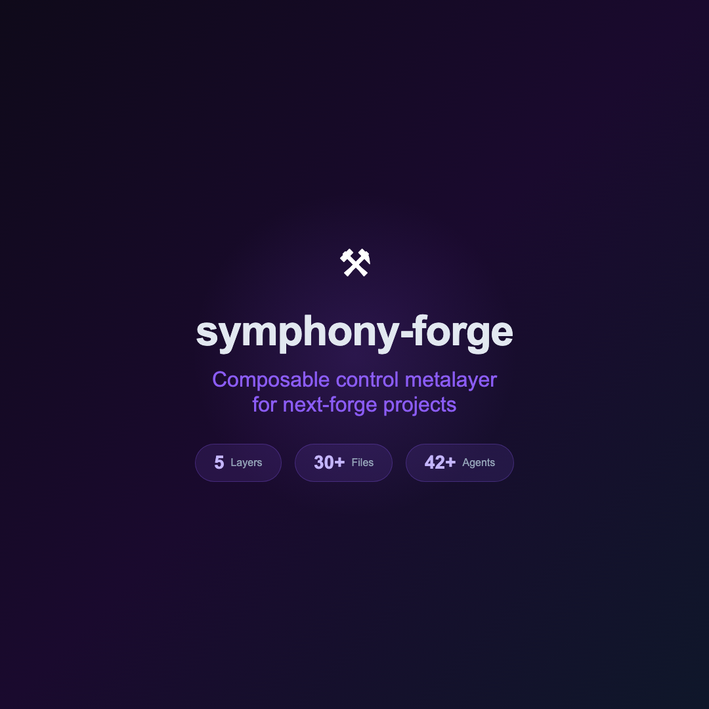
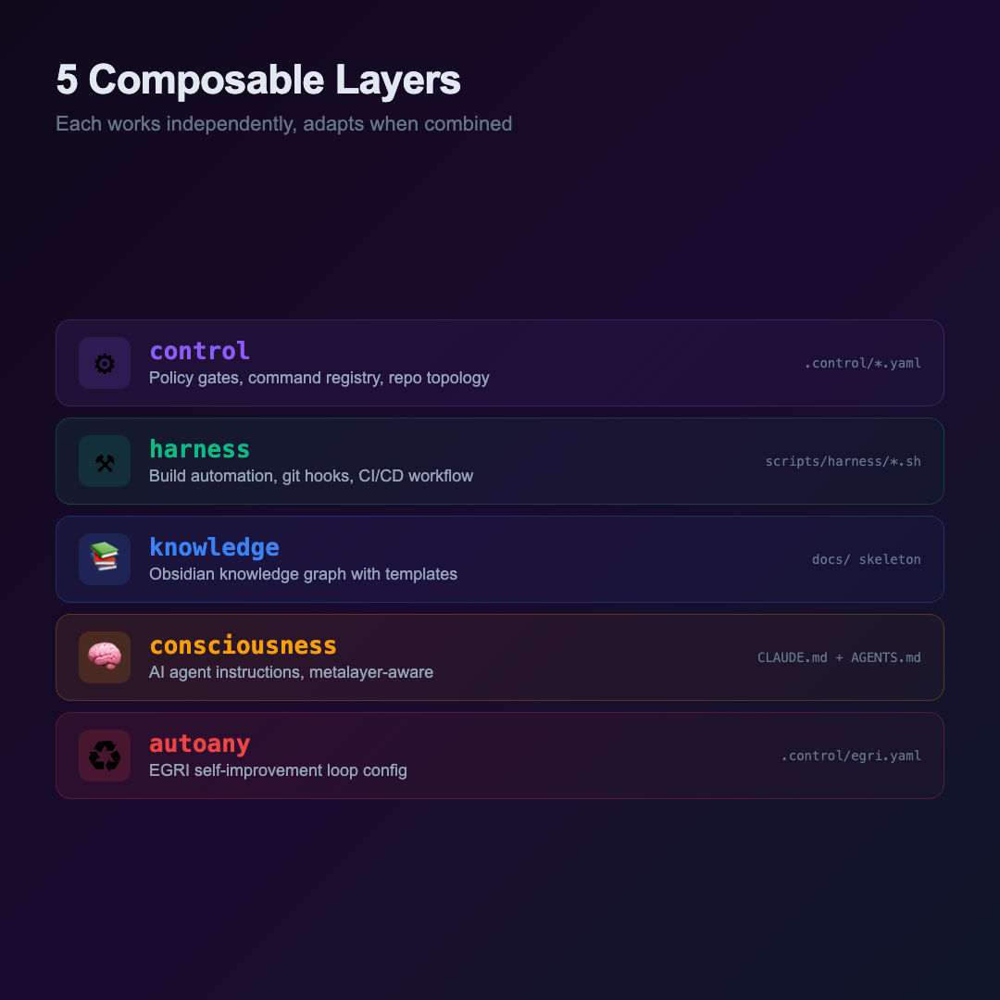
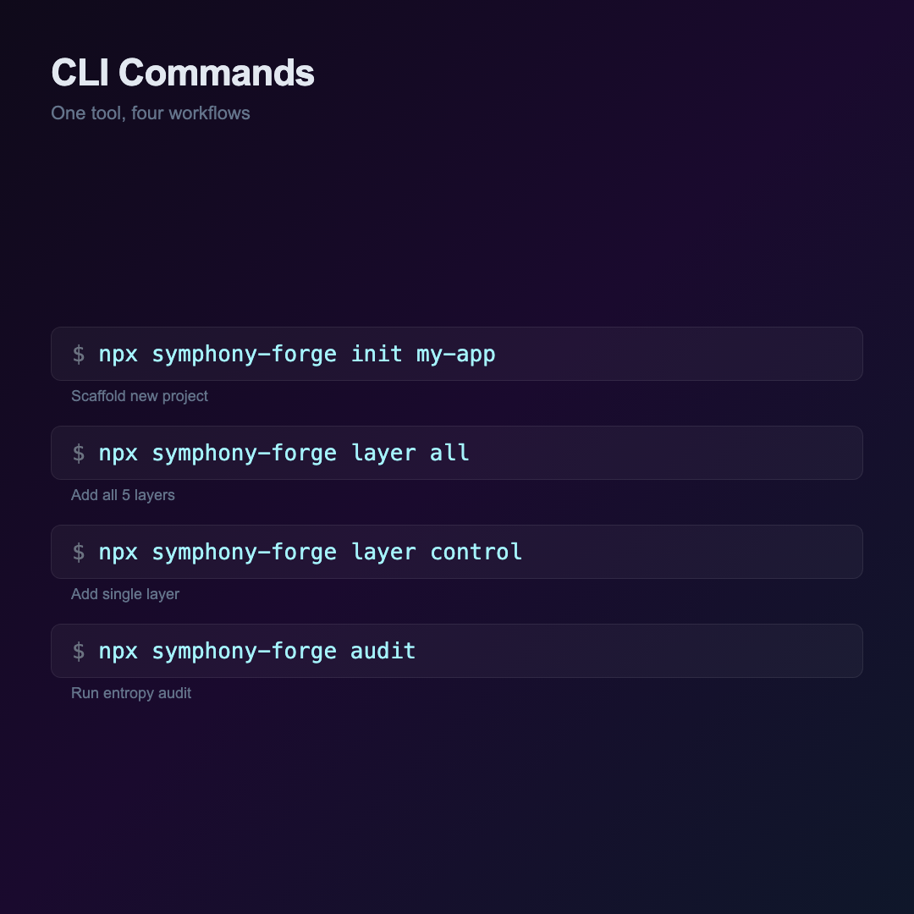
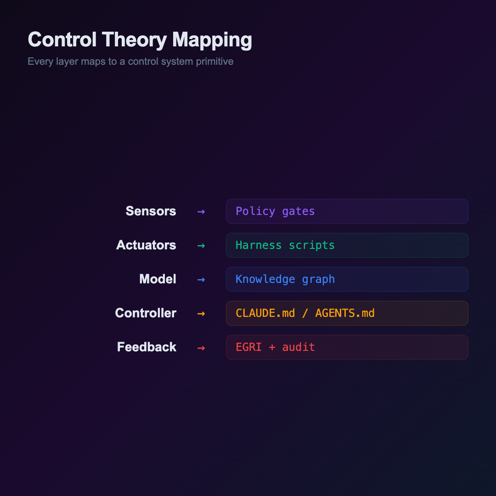
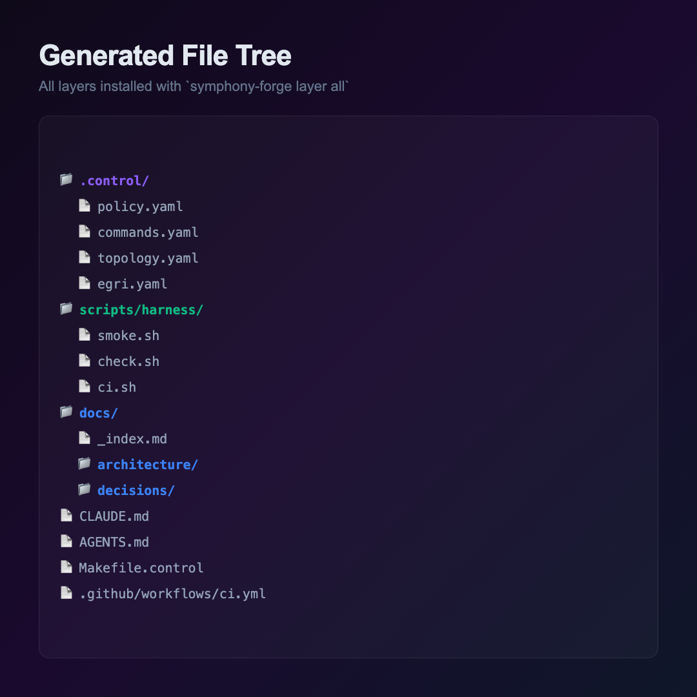
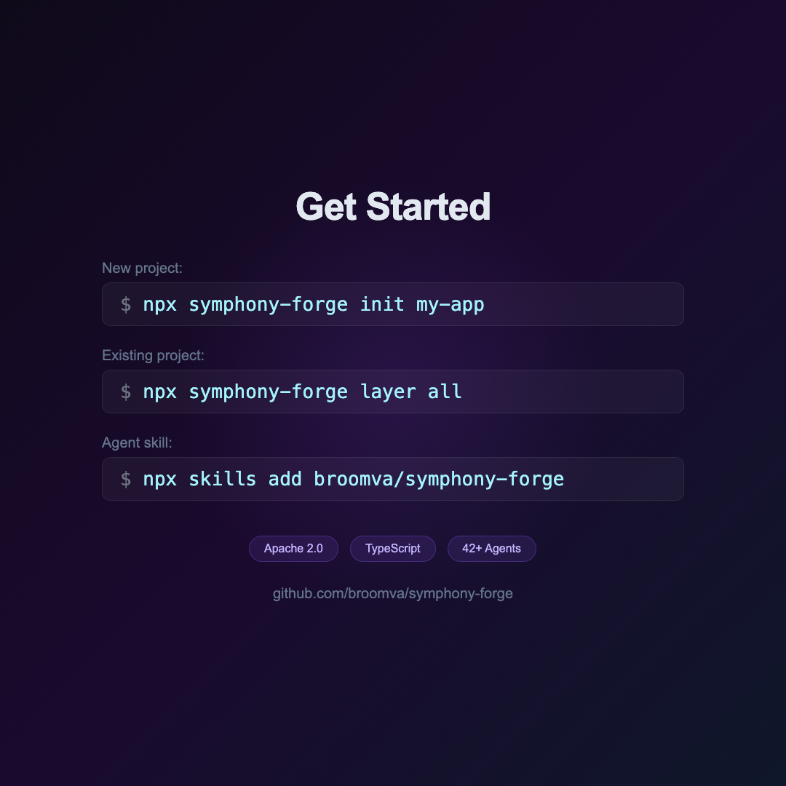

# symphony-forge Showcase

> [!context]
> Product showcase for symphony-forge — a 35-second animated video (1080x1080, 30fps) built with Remotion. Covers what it is, the 5 layers, CLI commands, control theory mapping, generated file tree, and install instructions.

## Video Scenes

### 1. Intro (5s)
Title card with anvil icon, tagline, and stat pills (5 layers, 30+ files, 42+ agents).



### 2. Composable Layers (7s)
All 5 layers with color-coded cards showing name, icon, description, and generated files.



### 3. CLI Commands (6s)
Terminal-style command blocks with typing animation for init, layer, and audit commands.



### 4. Control Theory Mapping (6s)
Side-by-side mapping: Sensors → Policy gates, Actuators → Harness scripts, Model → Knowledge graph, Controller → CLAUDE.md, Feedback → EGRI + audit.



### 5. Generated File Tree (6s)
Color-coded file tree showing all generated files across layers with staggered reveal animation.



### 6. Get Started / CTA (5s)
Three install paths (new project, existing project, agent skill) with badges and GitHub URL.



## Rendering

```bash
cd projects/symphony-forge-showcase
npm install
npx remotion render SymphonyForgeShowcase out/showcase.mp4
```

Preview in browser:
```bash
npx remotion studio
```

Render GIF fallback:
```bash
npx remotion render SymphonyForgeShowcase out/showcase.gif --every-nth-frame=3
```

## Remotion Project Structure

```
projects/symphony-forge-showcase/
├── src/
│   ├── index.ts                    # registerRoot entry
│   ├── Root.tsx                    # Composition (1080x1080, 30fps, 1050 frames)
│   ├── SymphonyForgeShowcase.tsx   # Master timeline using <Series>
│   ├── data/content.ts             # Layers, commands, file tree, metalayer data
│   ├── scenes/
│   │   ├── Intro.tsx               # Title + stats (150 frames)
│   │   ├── LayersScene.tsx         # 5 layer cards (210 frames)
│   │   ├── CommandsScene.tsx       # CLI commands with typing (180 frames)
│   │   ├── MetalayerScene.tsx      # Control theory mapping (180 frames)
│   │   ├── FileTreeScene.tsx       # Generated file tree (180 frames)
│   │   └── InstallScene.tsx        # CTA + install commands (150 frames)
│   └── components/
│       ├── AnimatedText.tsx         # Spring-animated text
│       ├── CodeBlock.tsx            # Terminal command block
│       └── LayerCard.tsx            # Color-coded layer card
└── out/
    ├── showcase.mp4                # Rendered video (3.1 MB)
    └── showcase.gif                # GIF fallback
```

## Related

- [[architecture/symphony-forge-cli]] — CLI architecture
- [[showcase/skills-inventory]] — Skills ecosystem inventory
- [[showcase/thread]] — X thread copy
